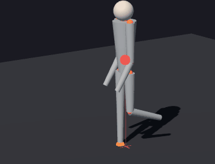

# Stickman

A layered 3D human figure with animation, center of mass, support polygon, and inverse kinematics — running entirely in the browser via Three.js, with no build tooling.



The project is a learning playground: each concept (forward kinematics, IK, balance, gait, swimming, climbing) is isolated in its own demo so it can be inspected and tweaked in isolation.

## Quick start

ES modules need an HTTP server. From the project root:

```bash
python -m http.server 8000
```

Then open <http://localhost:8000/>.

No `npm install`, no bundler, no transpiler. Three.js is loaded via an import map in each demo.

## Demos

| # | Demo | What it shows |
|---|------|---------------|
| 01 | Static | Rest pose. Sanity check that model + view render. |
| 02 | Poses | Stand / T-pose / Sit / Wave / Squat preset buttons. |
| 03 | DOF playground | Sliders for height, root transform, and all 14 DOF. |
| 04 | Animation | Procedural sin/cos cycles: idle, breathing, waving, dance, squats. |
| 05 | CoM | Weighted center of mass + horizontal projection on the floor. |
| 06 | Stability | Support polygon, stability indicator (green = stable, red = falling). |
| 07 | Snap | Snap-to-floor on/off; figure tracks the floor regardless of pose. |
| 08 | Lerp | Smooth pose interpolation (`Pose.lerp` + smoothstep). |
| 09 | Walk | Leg cycle + counter-swinging arms, support points switch on step. |
| 10 | IK | 2-bone IK: drag a target, the selected limb follows. |
| 11 | Swim | Horizontal body (root rotation), three styles: front crawl, backstroke, breaststroke. |
| 12 | Climb | Ladder climbing, 4-limb cycle, root moves upward. |
| 13 | IK walk | Stance leg holds the ankle still via IK; the body moves forward like a real step. |
| 14 | Head support | Pincha (head + elbows) vs. Kapalasana (head + palms). Tripod stability. |

## Architecture

Strict layering — each layer is allowed to import only from the layers below it.

```
src/model/      MODEL — pure data + math, no Three.js
  Joint.js          hierarchy node (DOF, limits, signs, angles)
  Skeleton.js       proportions, hierarchy, FK, CoM, support points, snapToFloor
  Pose.js           snapshot of joint angles (capture / apply / lerp)
  Mat4.js           4x4 matrix (column-major, custom)
  IK.js             two-bone IK (solveTwoBoneIK)

src/view/       VIEW — Three.js rendering of the model
  StickmanView.js   THREE.Group hierarchy, bones, joints, head, CoM/support markers

src/scene/      SCENE — shared environment
  BasicScene.js     renderer, camera, OrbitControls, lights, shadows, floor, pause

src/util/       UTILITIES — pure functions, no Three.js
  Geometry.js       distXZ, distPointToSegmentXZ, convexHullXZ, pointInConvexPolygonXZ
  DemoUI.js         addSlider, addToggle, addButtonGroup, injectStyles

src/library/    POSE LIBRARY — defined once, imported everywhere
  Poses.js          stand, tpose, sit, squat, wave, oneLegL/R, lunge, leanForward, ...

demos/          one HTML page per demo
```

The model layer never imports from view or scene. The view never imports from scene. Utilities and the pose library never import from view.

## Tech stack

- **Three.js r170** via an import map — no npm, no bundler.
- **ES modules** in `src/` (relative imports like `from '../src/...'`).
- **Vanilla JS + HTML** in demos. No frameworks.
- **Python 3** for the dev server (`http.server`).

## Key conventions

A few non-obvious decisions worth knowing before reading the code:

- **The figure faces -Z.** Right hand = +X, left hand = -X, forward = -Z. The camera defaults to +Z (it sees the face).
- **Anatomical angles + per-axis signs.** `Joint.angles` are anatomical (positive = natural direction: flexion, abduction outward). `Joint.signs.{x,y,z}` (±1) translate to Three.js rotations. Defined once in `Skeleton._build()` so demos stay readable: `setAngle('elbowL', 'x', 90)` means a 90° bend, no magic signs at the call site.
- **Three.js r155+ physically correct lights.** Light intensities are in physical units (lumens/candela). Old values (0.5–1.5) render very dark. `BasicScene` uses `AmbientLight 1.5` and `DirectionalLight 3.5`.
- **Forward kinematics is cached.** After changing angles, `joint.worldPosition` is stale until `skel.computeWorldTransforms()` runs. `getCenterOfMass()` and `getJointWorldPosition()` call it internally.
- **`Pose.apply()` resets the root.** `apply()` calls `skeleton.reset()`, which clears `rootPosition` and `rootRotation`. Set those *after* `pose.apply()`, not before.
- **Pose interpolation is hybrid.** Angles lerp linearly; `supportPoints` are discrete and switch at `t = 0.5`.

## Project rules

The full set of project conventions, gotchas, and extension points lives in [`CLAUDE.md`](./CLAUDE.md). Read it before adding a new joint, demo, or layer.

## License

[MIT](./LICENSE) — © 2026 mrklas69.
